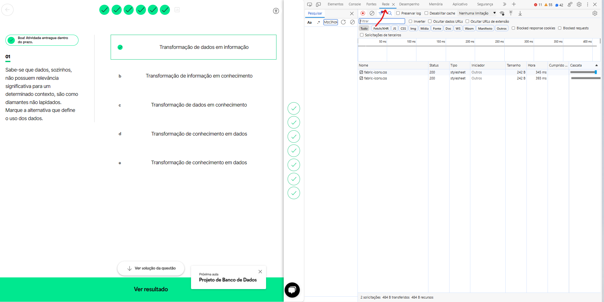
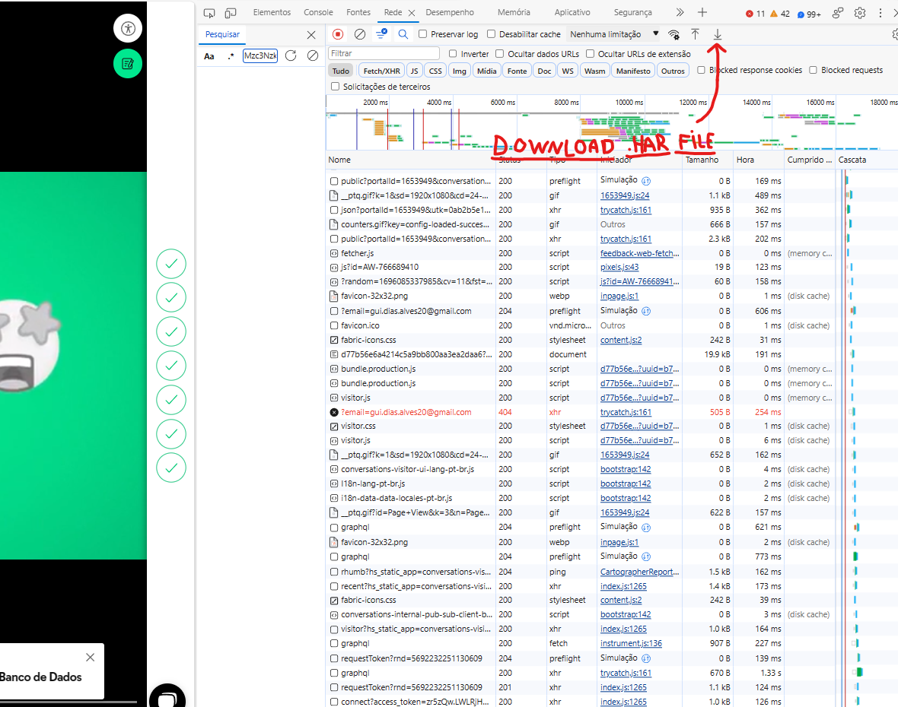
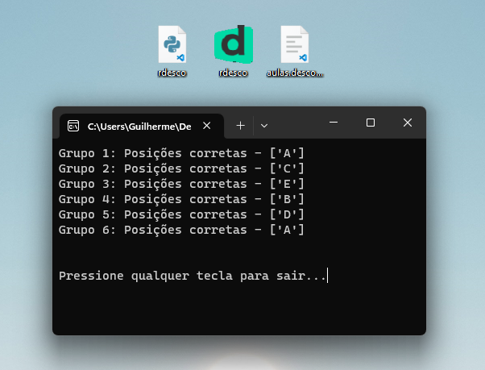

# descomplicando

---------

## Como usar

1. Entre em de qualquer exercicio na descomplica, clique em qualquer lugar da tela com o botão direito do mouse, e inspecione a tela, ou use o atalho *CTRL + SHIFT + I*. Em seguida, clique em "Redes" ou "Networking".

2. Atualize a página, quando ela carregar completamente, faça o download do arquivo .har clicando no botão de download no canto superior direito.

3. Após isso, reuna na mesma pasta o arquivo `descomplicando.exe` junto com o arquivo `.har`, e execute o arquivo `descomplicando.exe`.

 

---------

 

> *Vale a pena ressaltar que a finalidade principal dessa ferramenta **não é incentivar os alunos a evitar os estudos**, mas sim auxiliar aqueles que já possuem conhecimento sobre o assunto e preferem não revisar tudo novamente. Também é uma ajuda valiosa para aqueles que tiveram dificuldades para cumprir prazos. No entanto, enfatizo que a **responsabilidade** pelo uso adequado da ferramenta recai sobre cada indivíduo.*

